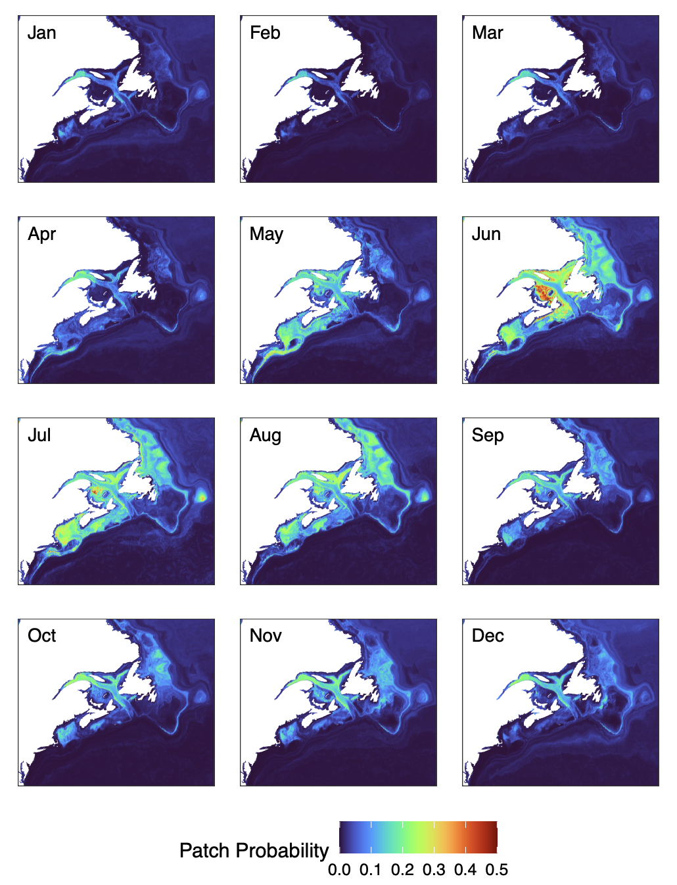
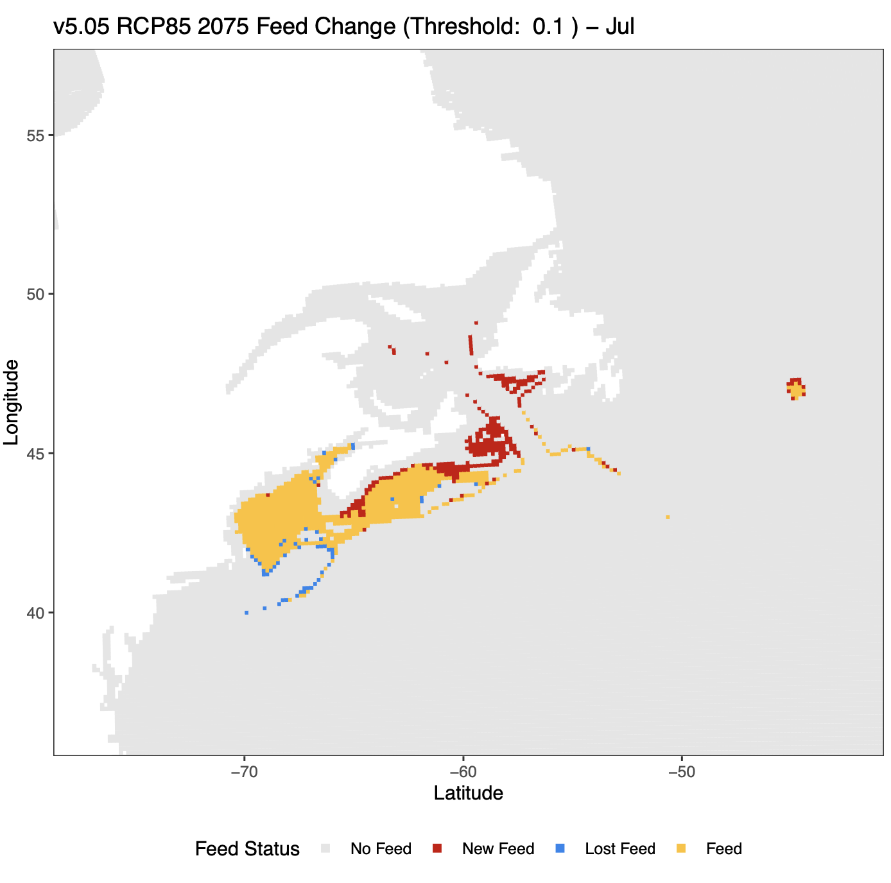

# Version 2

**v2.00 - v2.20**

*4/14/2022 - 6/9/2022*

### Changes

* Creation of the yaml system and file setup
* Monthly predictions: integration of month as covariate, exploration of separate models per month
* Feeding habitat plots pioneered
* Downscaled prediction maps, experimenting with algorithms, generally all-atlantic

### Example Plots

