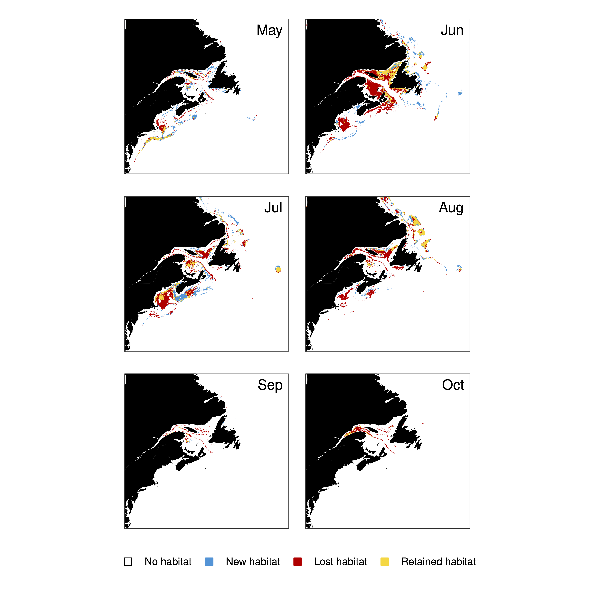

# Version 5 

**v5.00.00 - v5.20.1**

*2/17/2023 - 4/20/2023*

### Changes

* **Complex, non-linear bathymetric post-model correction**
  * experimentation and publishable function
* modularized plot code, general rewrite of codebase
* Experimentation with quantile predictions
* Cropped prediction processing = reduced runtimes
* Additional experimentation with `keras` neural network algorithms

### Example Plots

