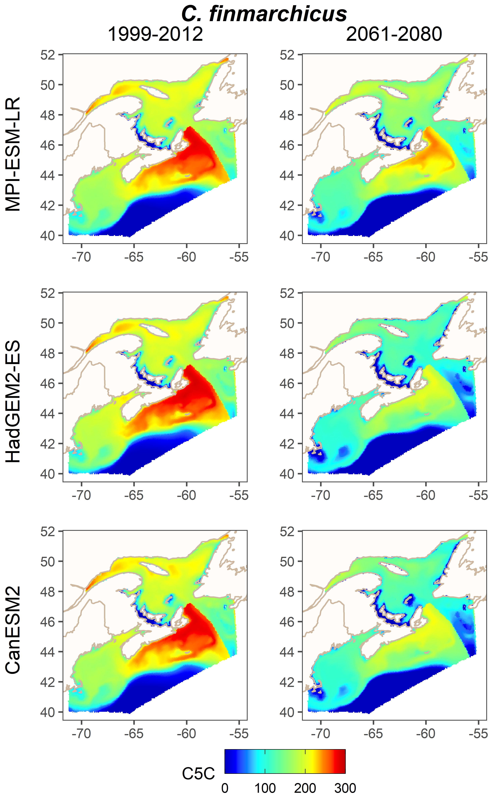

```{r setup, include=FALSE}
knitr::opts_chunk$set(echo = TRUE)

library(purrr)
library(sf)
library(dplyr)
library(ggplot2)
library(data.table)
library(brickman)
library(stars)
library(ggforce)
library(ggpubr)
```

threshold and dry weight temperatures are region dependent -- how well does this translate to decades in the future when regional relationships may very well change? 

# Initial Dataset

This code block will create threshold and dry weight factor estimates for brickman points.

Caroline's dynamic thresholds create *cfin* dry weight estimates based on June and August. Therefore, we will read these months and downsample by 75% to improve runtime. 

```{r}
bathy <- brickman::read_brickman(scenario = "PRESENT", 
                                     vars = c("Bathy_depth", "land_mask"), 
                                     interval = "ann", 
                                     form = "stars")

sst <- brickman::read_brickman(scenario="PRESENT", 
                               vars = "SST", 
                               interval = "mon", 
                               form = "stars")

brickman <- c(bathy, slice(sst, month, 6), slice(sst, month, 8)) |>
  st_downsample(n = 1) |>
  st_as_sf(coords = c("x", "y"), crs = 4326) |>
  filter(land_mask == 1) |>
  na.omit() |>
  rename(SST_jun = SST, SST_aug = SST.1) 
```

# Mapping regions

Next, we map these brickman points to regions provided by Caroline. Points outside of the regions are omitted.
```{r}
regions <- read_sf(dsn = "shapefiles/Regions_dw_vd_poly_all.shp") |>
  st_make_valid() |>
  st_transform(crs = 4326)

brickman <- mutate(brickman, region_tc = 
                     st_intersects(brickman, regions, sparse = FALSE) |>
                     apply(1, function(u) ifelse(any(u), regions$id[which(u)], NA))) |>
  na.omit()
```
```{r, echo = FALSE}
ggplot() +
  geom_sf(data = brickman, aes(col = region_tc), alpha = .7) +
  geom_sf(data = regions, alpha = 0, col = "black") +
  geom_polygon(data = ggplot2::map_data("world"), 
               aes(long, lat, group = group),
               fill = "lightgray", col = "gray") +
  geom_sf_label(data = regions, aes(label = id), size = 2) +
  coord_sf(xlim = c(-70, -40), ylim = c(40, 60), expand = TRUE) +
  theme_bw() + 
  theme(legend.position = "none") +
  ggtitle("Brickman points by dry weight region")
```

# Dry weight conversion

Next, we implement Caroline's dry weight conversion equation to determine *C. Finmarchicus* dry weight multiplier at each present-day brickman point. Dry weight in is units of micrograms ($\mu g$). 

Original conversion from Caroline: 
```{r, eval = FALSE}
pres |> 
  mutate(Cfin_C5C = 
           ifelse(REGION_predictions %in% c("GoM", "WSS", "ESS") & MONTH %in% c(5,6),
                  (-18.8 * T0_50)+332,
                  ifelse(REGION_predictions %in% c("neGSL","nwGSL", "sGSL", "sNL") 
                         & MONTH %in% c(7,8), (-18.8 * T0_50)+332, NA)),
         Chyp_C4C = 
           ifelse(REGION_predictions %in% c("GoM", "WSS", "ESS") & MONTH %in% c(4,5),
                  ((-4.71 * T0_50)+94)*6,
                  ifelse(REGION_predictions %in% c("neGSL","nwGSL", "sGSL", "sNL") 
                         & MONTH %in% c(5,6), ((-4.71 * T0_50)+94)*6, NA)),
         Cgla_C4C = 
           ifelse(REGION_predictions %in% c("GoM", "WSS", "ESS") & MONTH %in% c(4,5),
                  ((-4.71 * T0_50)+94)*2,
                  ifelse(REGION_predictions %in% c("neGSL", "nwGSL", "sGSL", "sNL") 
                         & MONTH %in% c(5,6),((-4.71 * T0_50)+94)*2, NA)))
```

Implementing for Brickman: 

* Currently, we do not have T0-50m from the Brickman dataset. At present I've decided to make do with SST, but this is not ideal.  
* Dry weight is only provided for a single stage of each species. This stage is the stage at which the individual enters diapause, and so the assumption is that the weight will stay constant through later stages. 
* Only a subset of months and regions are available. Solutions:
  * Assume that summer temperatures will determine calanus biomass for all other months. 
  * Assume that "NL" behaves like GSL. 

```{r}
brickman <- brickman |>
  rowwise() |>
  mutate(idw = (-18.8 * ifelse(region_tc %in% c("GoM", "WSS", "ESS"), 
                               SST_jun, SST_aug)) + 332) |>
  ungroup()

quantile(brickman$idw, probs = c(0, .05, .50, .95, 1.00))
```
```{r, echo = FALSE}
ggplot(brickman) +
  geom_histogram(aes(x = idw), bins = 50, col = "white", fill = "orange") +
  theme_bw() + 
  ggtitle("Individual dry weight distribution")
```
```{r, echo = FALSE}
ggplot() +
  geom_sf(data = brickman, aes(fill = idw), col = NA) +
  viridis::scale_fill_viridis() +
  geom_sf(data = regions, alpha = 0, col = "black") +
  geom_polygon(data = ggplot2::map_data("world"), 
               aes(long, lat, group = group),
               fill = "lightgray", col = "gray") +
  coord_sf(xlim = c(-70, -40), ylim = c(40, 60), expand = TRUE) +
  theme_bw() + 
  ggtitle("Brickman points by individual dry weight")
```

# Manipulating to reasonable dry weight

Expected thresholds from Caroline: 



Differences are likely due to the fact that I'm using SST instead of T0-50. Currently waiting on T0-50 values to consider, but in the meantime:

* put bottom cap on dry weight --  no less than C4 size (average 82 ug, plourde et al 2019)
* The relative distribution of high and low values looks roughly the same. Obviously this is not a vigorous scientific solution, but as a bandaid I'm just going to add 120 mg to all measurements (300 - 180, estimated from graphs).
* primary concerns with GSL

```{r}
brickman <- brickman |>
  mutate(bidw = map(idw + 120, ~max(82, .x)) |> unlist())
```

```{r, echo = FALSE}
ggplot() +
  geom_sf(data = brickman, aes(fill = bidw), col = NA) +
  viridis::scale_fill_viridis() +
  geom_sf(data = regions, alpha = 0, col = "black") +
  geom_polygon(data = ggplot2::map_data("world"), 
               aes(long, lat, group = group),
               fill = "lightgray", col = "gray") +
  coord_sf(xlim = c(-70, -40), ylim = c(40, 60), expand = TRUE) +
  theme_bw() + 
  ggtitle("Brickman points by bandaid individual dry weight")
```

# Original Threshold 

Next, we find the threshold values for the brickman points. Threshold depends on bathymetry, month, and region and is determined via the text tables provided by Caroline. We will determine threshold for the months of January, April, July, and November.

Some regions are clumped together for threshold conversions. 
```{r}
region_thresholds <- function(region_tc) {
  if (region_tc == "GoM") {
    "gom"
  } else if (region_tc == "WSS") {
    "wss"
  } else if (region_tc %in% c("ESS", "sNL")) {
    "ess"
  } else {
    "gsl"
  }
}

brickman <- select(brickman, -land_mask, -SST_aug, -SST_jun) |>
  mutate(Jan = 1, Apr = 4, Jul = 7, Nov = 11) |>
  rowwise() |>
  mutate(region_thresholds = region_thresholds(region_tc))
```

Not all months perform well in the text conversion due to lack of data, so we map to adjacent months using mapping provided by Caroline. 
```{r}
month_map <- matrix(c(
  11, 11, 4, 4, 6, 6, 6, 9, 9, 10, 11, 11,
  11, 11, 4, 4, 5, 6, 6, 9, 9, 10, 11, 11, 
  11, 11, 3, 5, 5, 6, 7, 8, 9, 11, 11, 11,
  1, 1, 4, 4, 4, 7, 7, 8, 8, 12, 12, 12), 
  nrow = 12,
  dimnames = list(c(1, 2, 3, 4, 5, 6, 7, 8, 9, 10, 11, 12), c("ess", "wss", "gsl", "gom"))
)

brickman <- brickman |>
  mutate(across(Jan:Nov, ~month_map[[.x, region_thresholds]]))

brickman_mon <- brickman
```

```{r}
thresholds <- read.table("Calanus_threshold.txt", header = TRUE) |>
  group_by(month, region_vd)

tkeys <- group_keys(thresholds)
tlist <- group_split(thresholds, .keep = FALSE) |>
  map(~as.data.table(.x) |> 
        setkey(depth))
names(tlist) <- paste(tkeys$region_vd, tkeys$month)

get_threshold <- function(mon, bdepth, region) {
  tlist[[paste(region, mon)]][data.table(bdepth), roll = "nearest"]$Min_cfin_mgm2
}
brickman <- brickman |>
  mutate(across(Jan:Nov, ~get_threshold(.x, Bathy_depth, region_thresholds)))
```
```{r, echo = FALSE}
plot_month_h <- function(b_data, mon) {
  ggplot(b_data) +
  geom_histogram(aes(x = get(mon)), bins = 50, col = "white", fill = "orange") +
  labs(x = mon) +
  scale_x_continuous(limits = c(0, 500000)) +
  theme_bw()
}

mon_vec <- c("Jan", "Apr", "Jul", "Nov")

ggarrange(plotlist = map(mon_vec, ~plot_month_h(brickman, .x)), 
          nrow = 2, ncol = 2) |>
  annotate_figure(top = "Threshold_distribution")
```
```{r, echo = FALSE}
plot_month_m <- function(b_data, mon) {
  ggplot() +
  geom_sf(data = b_data, aes(fill = get(mon)), col = NA) +
  viridis::scale_fill_viridis(limits = c(0, 500000)) +
  geom_sf(data = regions, alpha = 0, col = "black") +
  geom_polygon(data = ggplot2::map_data("world"), 
               aes(long, lat, group = group),
               fill = "lightgray", col = "gray", size = .1) +
  coord_sf(xlim = c(-70, -40), ylim = c(40, 60), expand = TRUE) +
  theme_void() + 
  labs(fill = mon)
}

ggarrange(plotlist = map(mon_vec, ~plot_month_m(brickman, .x)), 
  nrow = 2, ncol = 2, common.legend = TRUE, legend = "right",
  labels = mon_vec) |>
  annotate_figure(top = "Brickman points by threshold value")
```

# Resting Threshold

Using new set of thresholds from Caroline, using minimum estimates. 

```{r}
thresholds <- read.table("Calanus_threshold_resting.txt", header = TRUE) |>
  group_by(month, region_vd)

tkeys <- group_keys(thresholds)
tlist <- group_split(thresholds, .keep = FALSE) |>
  map(~as.data.table(.x) |> 
        setkey(depth))
names(tlist) <- paste(tkeys$region_vd, tkeys$month)

get_threshold <- function(mon, bdepth, region) {
  tlist[[paste(region, mon)]][data.table(bdepth), roll = "nearest"]$Min_cfin_mgm2
}
brickman_r <- brickman_mon |>
  mutate(across(Jan:Nov, ~get_threshold(.x, Bathy_depth, region_thresholds)))
```

```{r echo=FALSE}
ggarrange(plotlist = map(mon_vec, ~plot_month_h(brickman_r, .x)), nrow = 2, ncol = 2) |>
  annotate_figure(top = "Resting threshold distribution")

ggarrange(plotlist = map(mon_vec, ~plot_month_m(brickman_r, .x)), 
  nrow = 2, ncol = 2, common.legend = TRUE, legend = "right",
  labels = mon_vec) |>
  annotate_figure(top = "Brickman points by resting threshold value")
```

```{r echo = FALSE}
ggarrange(plotlist = list(plot_month_h(brickman_r, "Apr"), 
                       plot_month_h(brickman, "Apr")),
          nrow = 1, ncol = 2, legend = "bottom", 
          labels = c("Resting", "Original")) |>
  annotate_figure(top = "Original vs. resting threshold")

ggarrange(plotlist = list(plot_month_m(brickman_r, "Apr"), 
                       plot_month_m(brickman, "Apr")),
          nrow = 1, ncol = 2, common.legend = TRUE, legend = "right", 
          labels = c("Resting", "Original")) |>
  annotate_figure(top = "Original vs. resting threshold")
```

# Necessary Abundance

what is the necessary abundance based on the bandaid temperature and resting thresholds?

```{r}
needed_ind_b <- brickman_r |>
  mutate(needed_ind = (Jul * 1000)/bidw)
```
```{r echo = FALSE}
ggplot(needed_ind_b) +
  geom_sf(aes(fill = needed_ind), col = NA) +
  viridis::scale_fill_viridis() +
  geom_sf(data = regions, alpha = 0, col = "black") +
  geom_polygon(data = ggplot2::map_data("world"), 
               aes(long, lat, group = group),
               fill = "lightgray", col = "gray") +
  coord_sf(xlim = c(-70, -40), ylim = c(40, 60), expand = TRUE) +
  theme_bw() + 
  ggtitle("Brickman points by needed abundance - July")
```
Version expressing needed abundance as percentile relative to actual dataset.

```{r}
root <- "/mnt/ecocast/projectdata/calanusclimate/src"
ae <- readr::read_csv(file.path(root, "tc_datasets/ae_regionvd_cfin.csv.gz"),
                      col_types = readr::cols())

quantile(ae$abundance, probs = c(0, .05, .5, .95, 1))
```

Plot considering only regions with threshold less than absolute maximum
```{r echo = FALSE}
ggplot(needed_ind_b |> filter(needed_ind <= 1.3387E6)) +
  geom_sf(aes(fill = needed_ind), col = NA) +
  viridis::scale_fill_viridis() +
  geom_sf(data = regions, alpha = 0, col = "black") +
  geom_polygon(data = ggplot2::map_data("world"), 
               aes(long, lat, group = group),
               fill = "lightgray", col = "gray") +
  coord_sf(xlim = c(-70, -40), ylim = c(40, 60), expand = TRUE) +
  theme_bw() + 
  ggtitle("Brickman points by plausible needed abundance - July")
```
```{r echo = FALSE}
perc <- ecdf(ae$abundance)

ggplot(needed_ind_b) +
  geom_sf(aes(fill = perc(needed_ind)), col = NA) +
  viridis::scale_fill_viridis() +
  geom_sf(data = regions, alpha = 0, col = "black") +
  geom_polygon(data = ggplot2::map_data("world"), 
               aes(long, lat, group = group),
               fill = "lightgray", col = "gray") +
  coord_sf(xlim = c(-70, -40), ylim = c(40, 60), expand = TRUE) +
  theme_bw() + 
  ggtitle("Brickman points by percentile value of needed abundance - July")
```