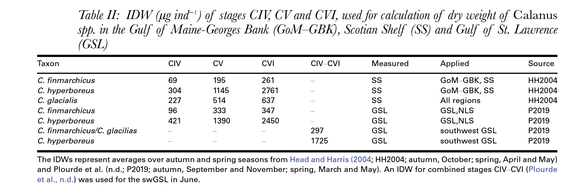
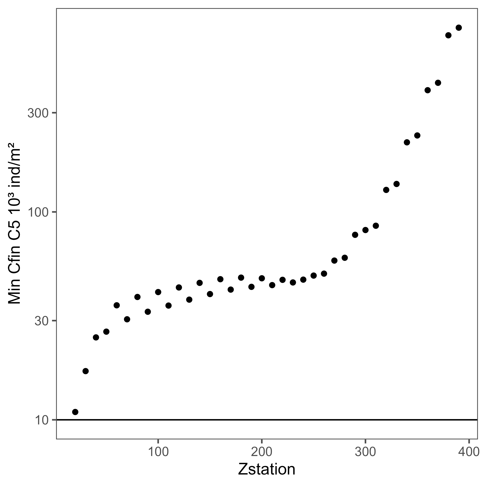
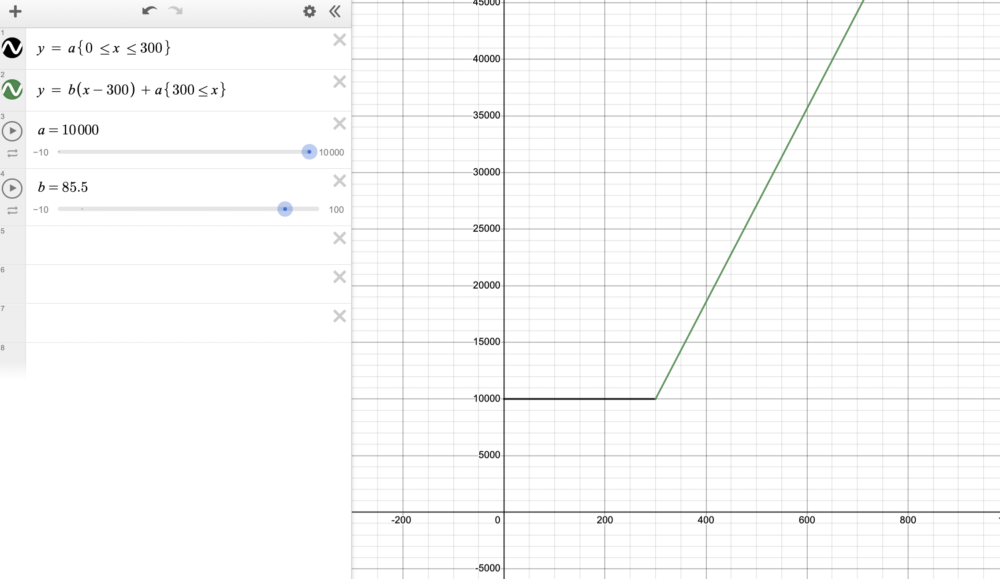

```{r setup, include=FALSE}
knitr::opts_chunk$set(echo = TRUE)

library(purrr)
library(sf)
library(dplyr)
library(ggplot2)
library(data.table)

filter_dates <- function(data, date_start, date_end) {
  if (!is.null(date_start)) {
    data <- filter(data, date >= as.Date(date_start))
  }
  if (!is.null(date_end)) {
    data <- filter(data, date <= as.Date(date_end))
  }
  data
}
```

## Setup

We read in the *C. Finmarchicus* dataset -- the merged ecomon/azmp dataset bound to Brickman environmental covariates. The ecomon dataset has been vertically corrected using Caroline's GAM and a region has been assigned to each datapoint (ESS, WSS, GoM, GSL)

```{r}
root <- "/mnt/ecocast/projectdata/calanusclimate/src"

ae <- readr::read_csv(file.path(root, "tc_datasets/ae_regionvd_cfin.csv.gz"),
                      col_types = readr::cols())
```

All estimates of individual dry weight are pulled from Sorochan et. al 2019. 


Using Sorochan et. al 2019, we convert abundance to dry weight using region and filter the points to be within 1990-2015. 

```{r}
ae_dw <- ae |>
  mutate(dry_weight = abundance * 
         map(region_tc, ~ifelse(.x == "gsl", 333, 195)) |> unlist()) |>
  filter_dates("1990-01-01", "2015-12-31")

glimpse(ae_dw)
```

## Threshold calculation setup

This was the original plot handed over by Stephan, whose shape inspired the base for my base/slope dynamic threshold.

* Slope of this graph after x = 300 = (1000-50)/100 = 9.5 additional cfin/m3 needed per meter of depth.

```{r echo = FALSE, out.width = '50%', fig.align = 'center'}

```

We create a "dynamic biomass threshold" that varies with bathymetry. When bathymetric depth is less than 300m, the threshold is constant at a **base** value (*a* in the below photo). When bathymetric depth is more than 300m, the threshold increases linearly with a **slope** (*b* in the below photo). **Goal: determine ideal base and slope for the model!**


What percent of points are in depths > 300 m, and where are they? 

```{r}
sum(ae_dw$Bathy_depth > 300)/nrow(ae_dw) 
```
```{r echo = FALSE}
ggplot(filter(ae_dw, Bathy_depth > 300), aes(x = lon, y = lat)) +
  geom_polygon(data = ggplot2::map_data("world"), 
               aes(long, lat, group = group),
               fill = "lightgray", col = "gray") +
  geom_point(aes(col = Bathy_depth), alpha = .7) +
  viridis::scale_color_viridis() +
  coord_quickmap(xlim = c(-76, -40), ylim = c(35, 60), expand = TRUE) +
  theme_bw() + 
  ggtitle("Points with depth more than 300 meters")
```

## Threshold experiments

We're using an averaged estimate of *cfin* biomass -- 264 ug

The below code builds a comparison that evaluates the percentage of patch points for a variety of combinations of slope and base values. 

**What range should base and slope vary between?**

* Base - from Camille's work, we vary between 10K to 40K abundance
* Slope - varies from 0 (no increase) to 1000 (significant increase) in abundance. 

```{r}
idw <- 264 

threshold_method <- function(pdepth, base, slope) {
  (pdepth * slope + base) |>
    sapply(function(x) min(x, 1500000 * idw))
}

base_values <- seq(10000, 40000, length.out = 20) * idw
# based around estimate from provided graph
slope_values <- seq(0, 1000, length.out = 20) * idw
```

```{r}
ae_perc <- ae_dw |> select(Bathy_depth, dry_weight, lon, lat) |>
  mutate(pdepth = sapply(Bathy_depth, function(x) max(x-300, 0)))

get_perc_patch <- function(base, slope) {
  counts <- ae_perc |>
    mutate(patch = dry_weight >= threshold_method(pdepth, base, slope)) |>
    count(patch) 
  
  counts[[2, 2]]/sum(counts$n)
}
```

```{r}
percents <- expand.grid(base = base_values, slope = slope_values) |>
  rowwise() |>
  mutate(percent = get_perc_patch(base, slope))

ggplot(percents, aes(x = base, y = slope, fill = percent)) +
  geom_raster() +
  theme_bw() +
  viridis::scale_fill_viridis()
```

The clear takeaway from this graph is that the base threshold is overwhelmingly what determines percentage above/below threshold, rather than the slope of the line above 300 meters.

## Graph comparisons

```{r echo = FALSE}
base_plot <- ggplot() +
    geom_polygon(data = ggplot2::map_data("world"), 
                 aes(long, lat, group = group),
                 fill = "lightgray", col = "gray") +
    coord_quickmap(xlim = c(-76, -40), ylim = c(35, 60), expand = TRUE) +
    theme_bw()

plot_base <- function(base, slope) {
  base_plot + 
    geom_point(data = mutate(ae_perc, 
                             patch = dry_weight >= 
                               threshold_method(pdepth, base, slope)) |>
                      filter(patch),
               aes(x = lon, y = lat),
               alpha = .7, size = .3) +
    ggtitle(paste("Base", base, ", Slope", slope))
}
```

How do plots vary with different bases?

* these plots only display **patch values**

```{r, out.width = '90%'}
base_vec2 = seq(10000, 40000, length.out = 4) * idw

slope = 100 * idw

ggpubr::ggarrange(
  plotlist = map(base_vec2, ~plot_base(.x, slope)), 
  nrow = 1, 
  ncol = 2, 
  common.legend = TRUE,
  legend = "right") |>
  walk(print)
```

How do plots vary with differing slopes? 

* these plots only display **patch values in areas over 300 meters**

```{r echo = FALSE}
plot_slope <- function(base, slope) {
  d <- ae_perc |>
    filter(pdepth > 0) |>
    mutate(patch = dry_weight >= threshold_method(pdepth, base, slope)) |>
    filter(patch)
  
  base_plot + 
    geom_point(data = d,
               aes(x = lon, y = lat),
               alpha = .7, size = .3) +
    ggtitle(paste("Base", base, ", Slope", slope))
}
```

When considering only points above 300 m, how does slope affect calculations?
```{r}
ggpubr::ggarrange(
  plotlist = map(c(1, 100, 300, 1000) * idw, 
                 ~plot_slope(40000*idw, .x)), 
  nrow = 1, 
  ncol = 2, 
  common.legend = TRUE,
  legend = "right") |>
  walk(print)
```


